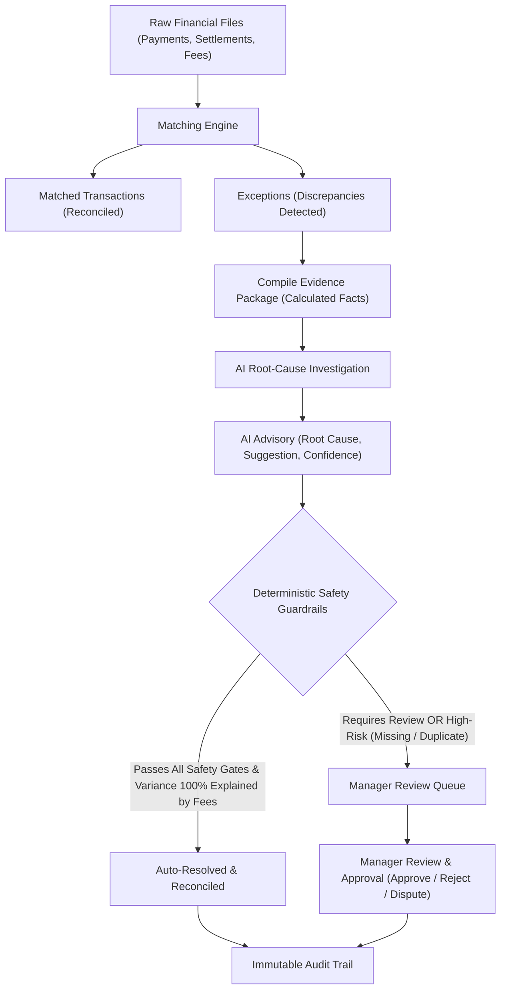
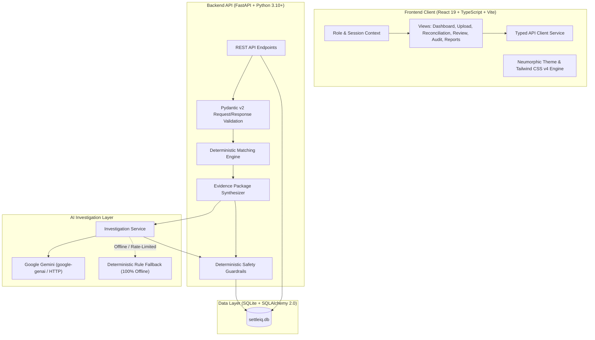

<div align="center">


# SettleIQ

### AI-Assisted Multi-Source Reconciliation & Exception Resolution

An intelligent financial operations platform that correlates fragmented payment processor settlements, order ledgers, and fee statements—safely resolving discrepancies through deterministic guardrails and explainable AI investigation.

[](https://www.python.org/)
[](https://fastapi.tiangolo.com/)
[](https://react.dev/)
[](https://www.typescriptlang.org/)
[](https://tailwindcss.com/)
[](https://vitejs.dev/)
[](https://www.sqlite.org/)

<br/>

**⚡ Reconciliation Engine Finds Discrepancies &nbsp;•&nbsp; 🤖 AI Investigates Root Causes &nbsp;•&nbsp; 🛡️ Guided Human Verification**

</div>

---

## Where this repo meets the Razorpay BuildaThon Track 4 AI Finance Controller Evaluation Criteria

| Evaluation Dimension | Where It's Demonstrated |
|---|---|
| **Problem Taste** | [The Problem We Solve](#the-problem-we-solve) |
| **Build Quality** | [System Architecture](#system-architecture), [Getting Started](#getting-started), automated pytest suite (`backend/tests/`) |
| **AI Judgment** | [Exception Resolution and Guardrails](#exception-resolution-and-guardrails) |
| **Failure Recovery** | [Engineering Journey & Problem-Solving Log](docs/WHAT_BROKE_AND_HOW_I_FIXED_IT.md) |

---

## Engineering Journey & Problem-Solving

> **"Built by solving real-world engineering problems, not just assembling a UI."**

Financial reconciliation systems cannot afford false positives—a reconciliation failure that requires human review is inconvenient, but a false-positive match that silently resolves is financially catastrophic. SettleIQ was hardened by discovering, isolating, and solving core edge cases across three critical system boundaries:

1. **Reconciliation Logic (Reference-Search Permissiveness)**: Hardened deterministic matching rules so candidate discovery never conflates partial or similar identifier matches (e.g. `PAY_10006` vs. `PAY_100060`) with verified financial identity.
2. **AI Integration (Schema Mismatch & Contract Enforcement)**: Corrected prompt assembly in `PromptBuilder` to ensure Google Gemini strictly returns the expected top-level JSON contract rather than falling back to 0.0 confidence.
3. **Test Infrastructure (Gemini Rate Limits & Test Isolation)**: Decoupled the automated pytest suite from live third-party API quotas via a deterministic provider fixture in `backend/tests/conftest.py`, achieving a repeatable 49/49 passing test suite.

👉 **[Read the full Engineering Journey & Problem-Solving Log](docs/WHAT_BROKE_AND_HOW_I_FIXED_IT.md)**

---

## Table of Contents

- [What is SettleIQ?](#what-is-settleiq)
- [The Problem We Solve](#the-problem-we-solve)
- [The SettleIQ Solution](#the-settleiq-solution)
- [Key Features](#key-features)
- [How It Works](#how-it-works)
- [Results on the Buildathon Demo Dataset](#results-on-the-buildathon-demo-dataset)
- [Interface Screenshots and Visual Flows](#interface-screenshots-and-visual-flows)
- [Role-Based Workflows](#role-based-workflows)
- [System Architecture](#system-architecture)
- [Exception Resolution and Guardrails](#exception-resolution-and-guardrails)
- [Technology Stack](#technology-stack)
- [Project Structure](#project-structure)
- [Getting Started](#getting-started)
- [Configuration](#configuration)
- [Security and Data Integrity](#security-and-data-integrity)
- [Known Limitations](#known-limitations)
- [User Flows](#user-flows)
- [Documentation Index](#documentation-index)
- [Future Roadmap](#future-roadmap)
- [License](#license)

---

## What is SettleIQ?

**SettleIQ** is an AI-assisted financial reconciliation platform for finance and operations teams. It connects data across internal sales orders, payment gateway payouts (like Stripe or Adyen), and processor fee statements to automatically match transactions, diagnose discrepancies, and assist teams in resolving exceptions.

---

## The Problem We Solve

In modern commerce, financial data is scattered across multiple platforms that rarely speak the same language:

* **Disagreements Across Sources**: Your internal database says an order was $100.00. Your bank deposit says $97.10. Without matching fee statements, this looks like missing money.
* **Mismatched References**: Payment gateways often use internal batch reference numbers that don't match your customer order IDs.
* **Spreadsheet Nightmares**: Operations teams spend days manually cross-referencing multi-file CSVs in Excel using complex VLOOKUP formulas.
* **The Automation Dilemma**: You can't let AI blindly move money or write off balances without guardrails. Yet manually checking every minor fee deduction takes too long.
* **No Audit Trail**: Spreadsheet edits leave no permanent history of who approved a change, why it was made, or what data justified it.

---

## The SettleIQ Solution

SettleIQ replaces manual spreadsheet reconciliation with a guided, reliable workflow:

1. **Brings Data Together**: Upload your payments, processor payouts, and fee statements via drag-and-drop.
2. **Finds Matches Automatically**: Applies mathematical rules to verify matching IDs, correlated order references, and recorded fee deductions.
3. **Isolates Real Exceptions**: Groups discrepancies into clear categories (fee variances, alternate reference matches, missing deposits, duplicate charges).
4. **AI Diagnoses Root Causes**: Uses AI to inspect the evidence package, identify why the discrepancy happened, and suggest a resolution.
5. **Safety Guardrails Protect You**: Automated resolution is permitted **only** when mathematical proof confirms the variance is 100% explained by recorded fees.
6. **Humans Stay in Control**: High-risk items (missing deposits or duplicate payouts) are sent directly to the Manager's Review Queue for sign-off.
7. **Complete Auditability**: Every upload, check, AI suggestion, and manager approval is permanently recorded with timestamps and user IDs.

---

## Key Features

> **Evaluation Scope**: SettleIQ currently demonstrates its multi-source reconciliation and exception-resolution workflow using the synthetic demo data and specified anomaly scenarios provided for **Razorpay Buildathon Track 4**. The system is evaluated against the benchmark anomaly categories defined for this track—including processing fee deductions (amount variances), alternate order reference correlations, missing settlement payouts, and duplicate processor settlements—safely pairing deterministic rule verification with AI advisory analysis. Rather than claiming unrestricted financial reconciliation across arbitrary real-world ledgers, SettleIQ provides a reliable, transparent implementation of AI-assisted reconciliation with strict guardrail enforcement for this specified evaluation boundary.

* **Multi-Source Data Ingestion**: Drag-and-drop CSV upload for payment records, processor settlements, and fee statements with instant schema validation and duplicate file detection.
* **Deterministic Matching Rules**: Transparent mathematical verification that accounts for exact reference IDs, alternate order correlations, interchange fee schedules, and payout timing windows.
* **Automated Evidence Compilation**: Packages all relevant transaction line items, fees, and calculated differences into an isolated, auditable evidence summary.
* **AI-Assisted Root Cause Analysis**: Leverages Google Gemini to explain discrepancies in plain language and recommend actions, with an automatic offline fallback when connectivity is unavailable.
* **Deterministic Safety Guardrails**: Hard safety gates requiring >= 0.90 confidence, verified evidence citations, positive settlement amounts, and policy compliance before any automated resolution.
* **Role-Based Workflows**: Dedicated views for **Analysts** (ingesting files and monitoring runs) and **Reconciliation Managers** (investigating exceptions, approving resolutions, or disputing charges).
* **Actionable Review Queue**: Interactive workspace for Managers to review pending exceptions, inspect correlated evidence, and record binding decisions (`Approve`, `Reject / Dispute`, or `Keep Unresolved`).
* **Immutable Audit Trail**: Chronological event history capturing every file upload, match, investigation rating, and user decision with timestamps.
* **Interactive Operations Dashboard**: Visual match rate indicators, financial variance KPI cards (Expected vs. Settled vs. Net Difference), and downloadable reconciliation summaries.

---

## How It Works

The platform ensures that AI serves as an advisory assistant while financial safety remains protected by deterministic rules:



---

## Results on the Buildathon Demo Dataset

Results vary with the dataset and anomaly distribution. For the synthetic demo dataset provided for the **Razorpay Buildathon Track 4** evaluation, SettleIQ reproduces the following reconciliation and exception-resolution results:

| Metric | Benchmark Result | Scope / Context |
|---|:---:|---|
| **Total Transactions Processed** | **100** | 100% ingestion volume from internal ledger (`payments.csv`) |
| **Total Expected Gross Value** | **INR 846,500.00** | Internal order ledger gross amount |
| **Total Verified Settled Amount** | **INR 687,546.00** | Bank & payment gateway settlements (`settlements.csv`) |
| **Net Settlement Discrepancy** | **INR 158,954.00** | Initial variance (Expected − Settled) |
| **Clean Matched Transactions** | **65 (65.0%)** | Clean 1-to-1 matches with zero discrepancy |
| **Exceptions Flagged** | **35** | Discrepancies identified for evidence compilation & AI analysis |
| **Automated Guardrail Resolutions** | **5 (14.29%)** | Successfully auto-resolved via deterministic safety guardrails |
| **Routed to Manager Review Queue** | **30** | Unresolved, high-risk, or policy-held cases awaiting manager sign-off |

> **Conditional Auto-Resolution**: SettleIQ does not claim 100% automatic resolution. Auto-resolution is strictly conditional—an anomaly is auto-resolved only when deterministic safety guardrails verify that the variance is 100% mathematically accounted for by recorded fees or exact reference correlation with confidence $\ge 0.90$. All other anomalies, including high-risk missing payouts and duplicate settlements, are safely routed to the human Review Queue for manager determination.

👉 **[Inspect the Buildathon Demo Dataset (`data/demo/`) →](data/demo)**

---

## Interface Screenshots and Visual Flows

SettleIQ provides a clean, role-tailored financial operations workspace designed for speed, clarity, and control across ingestion, matching, AI exception deep-dives, and decision management.

👉 **[View All Interface Screenshots & Visual Flows →](docs/SCREENSHOTS.md)**

---

## Role-Based Workflows

SettleIQ provides dedicated interfaces tailored to two distinct operational roles:

### Operations Analyst
* **What they see**: A focused workspace containing the **Dashboard** and **Upload** views.
* **What action they take**: Uploads transaction batches (`payments.csv`, `settlements.csv`, `fees.csv`), checks file preview validation, and starts the reconciliation run.
* **What the system does**: Validates file structure, flags duplicate records, matches transactions, and isolates anomalies.
* **What happens next**: The Analyst tracks high-level match rates, processed volumes, and variance totals on the Dashboard.

### Reconciliation Manager
* **What they see**: The complete management workspace, including **Dashboard**, **Reconciliation Hub**, **Exceptions**, **Review Queue**, **Audit Logs**, and **Reports**.
* **What action they take**: Runs batch investigations, opens the Review Queue, and reviews evidence packages in the deep-dive modal.
* **What the system does**: Presents compiled transaction facts, AI root-cause explanations, and safety guardrail check results.
* **What happens next**: The Manager makes an authoritative decision:
  * **Approve & Resolve**: Confirms the resolution and marks the transaction reconciled.
  * **Reject & Dispute**: Flags the transaction as disputed for processor inquiry or chargeback.
  * **Keep Unresolved**: Leaves the transaction open for follow-up investigation.

---

## System Architecture

SettleIQ is designed as a decoupled full-stack application:



> 📖 **[System Architecture Specification](docs/ARCHITECTURE.md)**

---

## Exception Resolution and Guardrails

SettleIQ clearly separates **AI investigation** (which diagnoses the cause) from **guardrail verification** (which determines whether an action is safe):

| Discrepancy Type | What Happened | Can It Auto-Resolve? | Policy Rule |
|---|---|:---:|---|
| **Fee Amount Mismatch** | Net payout is lower than payment amount. | **Conditional** | Resolves automatically **only** if recorded processing fees explain 100% of the difference and confidence >= 0.90. |
| **Alternate Reference Mismatch** | Direct ID missing, but matched via alternate order ID. | **Conditional** | Resolves automatically **only** if the net difference is exactly zero ($0.00). |
| **Missing Settlement** | Payment recorded internally has 0 payout records. | **Never** | Unaccounted processor funds must always be investigated by the Manager. |
| **Duplicate Settlement** | Multiple payout entries reference the same payment. | **Never** | Duplicate payouts present financial risk and require human review. |
| **Unknown Variance** | Discrepancy outside known mathematical rules. | **Never** | Automatically routed to the Review Queue for human investigation. |

### The 5 Safety Guardrail Checks
1. **Valid Recommendation**: Must suggest an allowed outcome (`AUTO_RESOLVE` or `HUMAN_REVIEW`).
2. **High Confidence Gate**: Advisory confidence score must be >= 0.90 (90%).
3. **Evidence Citation Check**: Every cited record ID must exist in the input evidence package.
4. **Policy Whitelisting**: High-risk discrepancy types (Missing, Duplicate, Unknown) are strictly prohibited from auto-resolution.
5. **Financial Sanity Checks**: Recorded fees must be non-negative (>= 0), settled amounts must be positive (> 0), and statuses cannot be pending.

---

## Technology Stack

### Backend
* **Language & Runtime**: Python 3.10+
* **Framework**: [FastAPI](https://fastapi.tiangolo.com/) (0.110+)
* **Data Validation & Settings**: [Pydantic v2](https://docs.pydantic.dev/) (2.6+) & `pydantic-settings`
* **Data Processing**: [Pandas](https://pandas.pydata.org/) (2.2+)
* **Database & ORM**: [SQLAlchemy](https://www.sqlalchemy.org/) (2.0+) with SQLite
* **Server**: [Uvicorn](https://www.uvicorn.org/) (0.28+)
* **Testing Suite**: [pytest](https://docs.pytest.org/) (8.0+)
* **PDF Export**: [ReportLab](https://www.reportlab.com/) (5.0+)

### Frontend
* **Framework**: [React 19](https://react.dev/) (19.2)
* **Language**: [TypeScript](https://www.typescriptlang.org/) (5.x)
* **Build Tool**: [Vite](https://vitejs.dev/) (8.x)
* **Styling**: [Tailwind CSS v4](https://tailwindcss.com/) with tactile neumorphic design
* **Icons**: [Lucide React](https://lucide.dev/) (1.37+)
* **Linter**: [Oxlint](https://oxc.rs/) (1.79+)

### AI & Reasoning
* **Primary Provider**: Google Gemini 1.5 / 2.0 Flash via Google GenAI SDK (`google-genai`)
* **Output Enforcement**: Structured JSON Schema validation via Pydantic
* **Offline Fallback**: Built-in Deterministic Rule Provider for offline operation during rate limits or connectivity loss

---

## Project Structure

```text
SettleIQ/
├── backend/
│   ├── app/
│   │   ├── ai/               # AI provider interface, Gemini client, prompt builder, factory
│   │   ├── api/              # FastAPI routers (health, upload, reconciliation, exceptions, review, audit, reports)
│   │   ├── database/         # SQLAlchemy engine, declarative Base, session management
│   │   ├── guardrails/       # 5-point deterministic guardrail validation engine
│   │   ├── models/           # Database models (payments, settlements, fees, runs, decisions, logs)
│   │   ├── reconciliation/   # Deterministic 5-rule reconciliation matching engine
│   │   ├── reports/          # Report aggregation and CSV export generators
│   │   ├── schemas/          # Pydantic request/response validation schemas
│   │   ├── services/         # Domain services (ingestion, reconciliation, evidence, AI, review, audit)
│   │   ├── config.py         # Application settings & environment binding
│   │   └── main.py           # Application entry point & CORS configuration
│   ├── tests/                # Automated pytest suite (unit, integration, guardrails, e2e)
│   └── requirements.txt      # Python dependencies
├── data/
│   ├── demo/                 # Benchmark synthetic dataset (100 payments, settlements, fees, ground truth)
│   ├── development/          # Development synthetic dataset (50 payments)
│   └── evaluation/           # Extended evaluation dataset (200 payments)
├── docs/
│   └── 05_USER_FLOWS.pdf     # User Flows and Maker-Checker Lifecycle Specification
├── frontend/
│   ├── public/               # Static web assets & branded icons
│   ├── src/
│   │   ├── assets/           # Logos and vector illustrations
│   │   ├── components/       # Views: auth, dashboard, upload, reconciliation, exceptions, review, audit, reports
│   │   ├── constants/        # Metric labels, navigation routes, user profile definitions
│   │   ├── context/          # React Contexts (UserContext for roles, ThemeContext for Light/Dark)
│   │   ├── services/         # Typed API client communicating with FastAPI backend
│   │   ├── types.ts          # Core TypeScript interfaces and domain schemas
│   │   ├── App.tsx           # Primary routing controller & view state container
│   │   └── main.tsx          # Application bootstrapping
│   ├── package.json          # Frontend dependencies & scripts
│   ├── tsconfig.json         # TypeScript configuration
│   └── vite.config.ts        # Vite & Tailwind CSS plugin configuration
├── scripts/
│   └── generate_data.py      # Deterministic synthetic financial dataset generator
├── .env.example              # Environment variables template
└── .gitignore                # Repository ignore rules
```

---

## Getting Started

### Prerequisites
- **Python**: Version 3.10 or higher
- **Node.js**: Version 18.x or higher (Node 20+ recommended)
- **npm**: Version 9.x or higher

---

### Step 1: Clone the Repository
```bash
git clone https://github.com/priiyxnshu/SettleIQ.git
cd SettleIQ
```

---

### Step 2: Configure Environment Variables
Copy the example environment template to configure your local backend:
```bash
cp .env.example backend/.env
```
Open `backend/.env` in an editor. If you wish to enable live Google Gemini AI investigations, populate your key:
```ini
GEMINI_API_KEY=your_google_gemini_api_key_here
LLM_PROVIDER=gemini
ENVIRONMENT=development
```
*(Note: If no API key is supplied, SettleIQ automatically falls back to its internal Deterministic Rule Provider, allowing all workflows, investigations, and guardrails to execute 100% offline).*

---

### Step 3: Backend Setup
1. Navigate to `backend` and create a virtual environment:
   ```bash
   cd backend
   python -m venv .venv
   ```
2. Activate the virtual environment:
   - **Windows (PowerShell)**:
     ```powershell
     .venv\Scripts\Activate.ps1
     ```
   - **Linux / macOS**:
     ```bash
     source .venv/bin/activate
     ```
3. Install dependencies:
   ```bash
   pip install -r requirements.txt
   ```
4. Start the FastAPI backend server:
   ```bash
   uvicorn app.main:app --host 127.0.0.1 --port 8000 --reload
   ```
   The API will be available at `http://127.0.0.1:8000` (Swagger docs at `http://127.0.0.1:8000/docs`).

---

### Step 4: Frontend Setup
1. In a separate terminal, navigate to `frontend`:
   ```bash
   cd frontend
   ```
2. Install npm dependencies:
   ```bash
   npm install
   ```
3. Start the Vite development server:
   ```bash
   npm run dev
   ```
4. Open your browser and navigate to `http://localhost:5173`.

---

### Step 5: Running Tests
To run the automated test suite across ingestion, reconciliation, evidence builders, guardrails, and review services:
```bash
cd backend
pytest -v
```

---

## Configuration

SettleIQ uses Pydantic's `BaseSettings` to manage configuration variables cleanly across environments:

| Environment Variable | Default Value | Description |
|---|---|---|
| `BACKEND_HOST` | `127.0.0.1` | Local IP address for the FastAPI server binding. |
| `BACKEND_PORT` | `8000` | Port for the FastAPI server. |
| `ENVIRONMENT` | `development` | Environment mode (`development`, `staging`, `production`). |
| `DATABASE_URL` | `sqlite:///./settleiq.db` | SQLAlchemy connection string. Defaults to local SQLite database. |
| `CORS_ORIGINS` | `http://localhost:5173,http://127.0.0.1:5173` | Allowed frontend origins for CORS headers. |
| `LLM_PROVIDER` | `gemini` | AI engine provider (`gemini`). Falls back to deterministic rule provider if unavailable. |
| `GEMINI_API_KEY` | *(Empty)* | Google AI Studio / Gemini API key. Keep private and never commit to Git. |

---

## Security and Data Integrity

SettleIQ is designed with security and compliance controls appropriate for financial workflows:

1. **Role-Based Workflow Access**: Enforces operational separation between data ingestors (`Operations Analyst`) and resolution approvers (`Reconciliation Manager`).
2. **Deterministic Guardrail Bounds**: Autonomous AI decision-making is strictly prohibited. Final auto-resolutions are hard-gated by deterministic Python guardrails requiring mathematical proof of fee matching.
3. **Secret Isolation**: All credentials and API keys are read strictly from local environment files (`.env`), which are excluded by `.gitignore`. No credentials exist in client bundles or public repository files.
4. **Append-Only Audit Logging**: Decisions, reviews, and rule checks create immutable audit trail records with actor IDs and precise UTC timestamps.
5. **Schema Validation**: Strict Pydantic models validate every API payload; CSV ingestion enforces structural schema headers and rejects malformed rows.

---

## Known Limitations

In the spirit of engineering transparency, the following technical limitations of the current prototype should be noted:

- **Database Concurrency**: The default configuration utilizes SQLite, which is suitable for local development and demonstration, but should be migrated to PostgreSQL for high-concurrency production deployments.
- **Synchronous Ingestion Batches**: Ingestion of massive CSV batches (>50,000 rows) currently processes synchronously; a production deployment would queue batches through Celery or Redis.
- **External Payment Processor Connectors**: Payout files are currently ingested via standardized CSV format rather than direct live webhook/SFTP connections to processor APIs.
- **LLM Rate-Limiting**: When operating on free-tier Gemini API quotas, heavy concurrent investigations may encounter HTTP 429 rate limits (mitigated seamlessly by the built-in deterministic fallback engine).

---

## User Flows

The complete user journey—from landing page role selection to file upload, batch reconciliation, exception deep-dive, manager sign-off, and audit log inspection—is documented in:

📄 **[View User Flows Specification](docs/05_USER_FLOWS.pdf)**

---

## Documentation Index

| Document | Path | Status |
|---|---|:---:|
| **User Flows & UX Lifecycle** | [`docs/05_USER_FLOWS.pdf`](docs/05_USER_FLOWS.pdf) | **Available** |
| **Demo & Evaluation Dataset** | [`data/demo/`](data/demo) | **Available** |
| **Engineering Journey & Fixes** | [`docs/WHAT_BROKE_AND_HOW_I_FIXED_IT.md`](docs/WHAT_BROKE_AND_HOW_I_FIXED_IT.md) | **Available** |
| **System Architecture** | [`docs/ARCHITECTURE.md`](docs/ARCHITECTURE.md) | **Available** |
| **Product Screenshots Gallery** | [`docs/SCREENSHOTS.md`](docs/SCREENSHOTS.md) | **Available** |

---

## Future Roadmap

The following enhancements represent planned future iterations beyond the current buildathon prototype:

### 1. Production-Grade Authentication *(Future Work)*
* **Secure User Login**: Transition from local profile switching to full email/password credentials authentication.
* **Token-Based Sessions**: JWT (JSON Web Token) authentication with secure HTTP-only cookies and token refresh rotation.
* **Granular RBAC Enforcement**: Cryptographically signed role claims verified at both API middleware and UI routing layers.

### 2. Dedicated Production Landing Page *(Future Work)*
* **Public Product Landing Page**: Dedicated public-facing marketing and product explanation page before authenticated login.
* **Interactive Feature Tour**: Visual overview of reconciliation capabilities, guardrails, and audit trail features.
* **Self-Service Demo Sandbox**: Dedicated sandbox environment for prospective teams to test sample statement batches.

### 3. Extended Enterprise Integrations *(Future Work)*
* **Direct Gateway Webhooks**: Live ingestion adapters for Stripe, Adyen, and PayPal settlement webhooks.
* **Asynchronous Task Queue**: Celery / Redis background task execution for processing multi-gigabyte statement archives.
* **Multi-Currency FX Variance Calculation**: Dynamic FX rate provider integration to reconcile multi-currency cross-border transactions.
* **Configurable Guardrail Policies**: UI-driven policy editor allowing Risk Managers to configure custom variance thresholds per processor without code modifications.

---

## Author

**Priyanshu Gupta**  
GitHub: <https://github.com/priiyxnshu>

---

## License

This project is prepared for demonstration and buildathon evaluator review. Official licensing terms will be finalized prior to public release.
