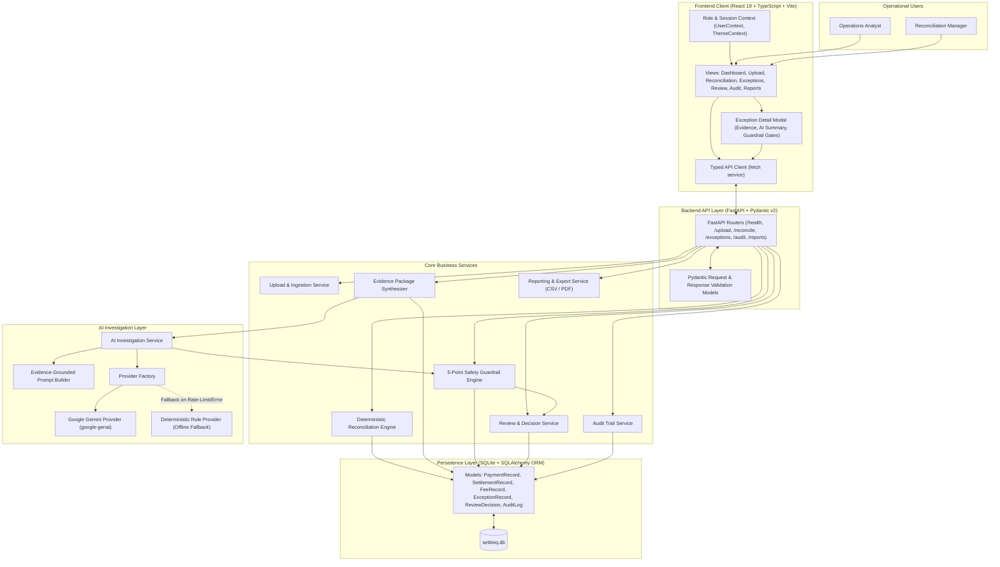
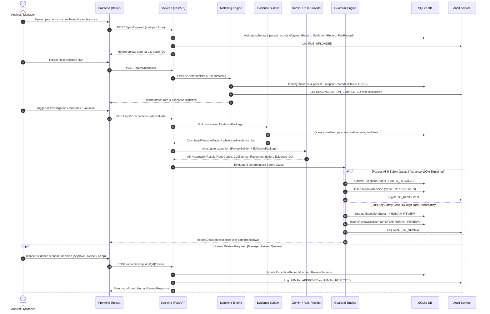
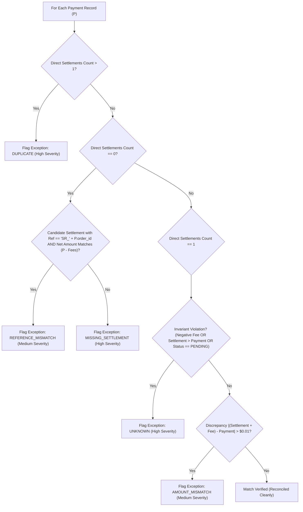
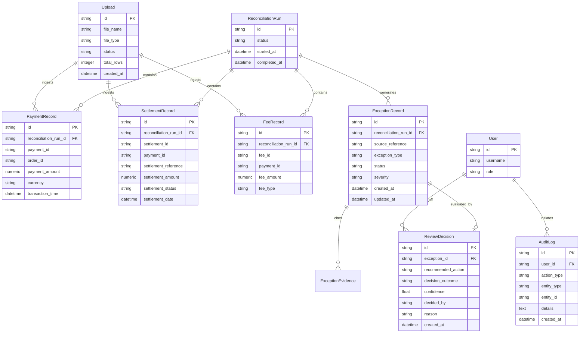
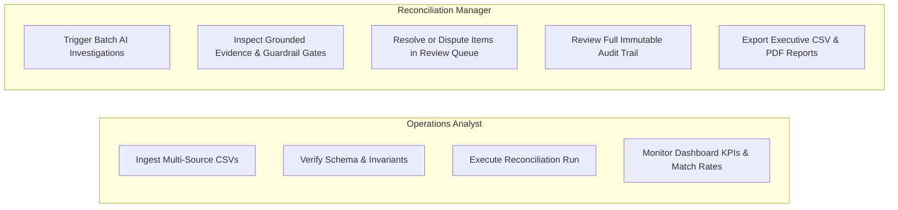

# SettleIQ System Architecture Specification

This document provides a technical specification of the current implementation of **SettleIQ**, an AI-assisted financial reconciliation and exception-resolution platform. It details the system components, end-to-end data flows, algorithmic matching logic, AI advisory pipeline, safety guardrail enforcement, persistence layer, and auditability mechanisms.

---

## Table of Contents

1. [System Overview](#1-system-overview)
2. [High-Level Architecture](#2-high-level-architecture)
3. [End-to-End Data Flow](#3-end-to-end-data-flow)
4. [Frontend Architecture](#4-frontend-architecture)
5. [Backend Architecture](#5-backend-architecture)
6. [Reconciliation Architecture](#6-reconciliation-architecture)
7. [AI Investigation Architecture](#7-ai-investigation-architecture)
8. [Guardrail Architecture](#8-guardrail-architecture)
9. [Human Review Architecture](#9-human-review-architecture)
10. [Database and Persistence](#10-database-and-persistence)
11. [Auditability and Traceability](#11-auditability-and-traceability)
12. [Role-Based Access and Workflows](#12-role-based-access-and-workflows)
13. [Deployment and Runtime Structure](#13-deployment-and-runtime-structure)
14. [Architectural Design Decisions](#14-architectural-design-decisions)

---

## 1. System Overview

**SettleIQ** is an intelligent financial operations platform engineered to solve multi-source transaction reconciliation and exception management. In modern commerce, gross revenue recorded in an internal sales ledger differs from net payout deposits in bank accounts due to payment gateway interchange fees, processing deductions, settlement timing windows, and reference identifier variances.

SettleIQ automates the cross-matching of three primary financial feeds:
1. **Internal Payment Records**: Gross expected sales transactions.
2. **Processor Settlement Records**: Net payout deposits from payment gateways (e.g., Stripe, Adyen).
3. **Gateway Fee Statements**: Interchange and gateway fee line items associated with payments.

The platform provides a guided, safe operational workflow:
* **Deterministic Matching**: Correlates transactions using strict mathematical and reference-matching rules.
* **Evidence Packaging**: Synthesizes verified financial facts, calculated discrepancies, and whitelisted record IDs.
* **AI Root-Cause Investigation**: Leverages Google Gemini to analyze anomalies, explain causes in plain language, and recommend actions.
* **Deterministic Safety Guardrails**: Hard-coded safety gates enforce financial invariants and policy checks before permitting automated resolution.
* **Human Verification**: Automatically routes high-risk or policy-held discrepancies to the Manager Review Queue for authorized sign-off.
* **Immutable Auditability**: Captures every ingestion event, match run, AI analysis, guardrail check, and reviewer decision with cryptographic precision.

---

## 2. High-Level Architecture

SettleIQ is structured as a decoupled full-stack application composed of an interactive React Single Page Application (SPA), a FastAPI REST backend, a deterministic rules and guardrail engine, an LLM reasoning layer with offline fallback, and an append-only relational persistence store.



---

## 3. End-to-End Data Flow

The lifecycle of financial data across SettleIQ follows a disciplined multi-stage pipeline:



---

## 4. Frontend Architecture

The frontend application is constructed with **React 19**, **TypeScript**, **Tailwind CSS v4**, and bundled via **Vite**. It employs a component-driven architecture organized by domain context:

### 4.1 Component Hierarchy & Layout
* **Application Bootstrapping (`main.tsx`)**: Mounts React DOM, establishes global context providers (`UserProvider`, `ThemeProvider`).
* **Root Application Shell (`App.tsx`)**:
  - Manages active tab state (`dashboard`, `upload`, `reconciliation`, `exceptions`, `review`, `audit`, `reports`).
  - Controls responsive collapsible sidebar (`Sidebar.tsx`) and global header (`Header.tsx`).
  - Gated view routing: Unauthenticated users are directed to the profile selection screen (`ProfileSelectionView.tsx`).
  - Enforces role-based tab accessibility.
  - Controls the global `ExceptionDetailModal.tsx` instance.
* **Domain Views**:
  - `DashboardView.tsx`: Displays real-time reconciliation match rate indicators, financial KPI summary cards (Expected Gross, Verified Settled, Net Variance), and exception category breakdowns.
  - `UploadView.tsx`: Interactive multi-source drag-and-drop file ingestion zone with CSV schema validation, file size checks, and batch ingestion history.
  - `ReconciliationView.tsx`: Operational execution cockpit for running reconciliation batches, displaying progress animations, and triggering batch investigations.
  - `ExceptionsView.tsx`: Paginated, filterable table of detected anomalies with status badges, discrepancy figures, and quick-action deep-dive triggers.
  - `ReviewQueueView.tsx`: Actionable queue specifically tailored for Reconciliation Managers, presenting pending exceptions requiring human verification.
  - `AuditLogsView.tsx`: Chronological event audit log viewer with search, action type filtering, and expandable metadata JSON payloads.
  - `ReportsView.tsx`: Executive summary generator with client-side tabular aggregations, live preview, CSV export, and server-generated PDF downloading.

### 4.2 State Management and Context
* **`UserContext.tsx`**: Holds the active operational profile (`Operations Analyst` vs. `Reconciliation Manager`), manages profile switching, and provides a permission gate helper (`hasPermission(tab)`).
* **`ThemeContext.tsx`**: Manages light/dark mode transitions with local storage persistence.

### 4.3 API Communication Layer (`services/api.ts`)
A strongly typed HTTP client using the native `fetch` API. It maps backend REST endpoints into Promise-based functions returning typed domain interfaces (`DashboardStats`, `ReconcileResponse`, `DecisionResponse`, `AuditLogItem`, etc.) and handles standardized HTTP error serialization.

---

## 5. Backend Architecture

The backend is built with **FastAPI** (Python 3.10+) and structured into distinct functional layers following separation of concerns:

```text
backend/app/
├── api/                  # FastAPI HTTP route handlers
│   ├── health.py         # System health & database readiness checks
│   ├── dashboard.py      # Aggregated KPI and metric endpoints
│   ├── upload.py         # Multi-file CSV ingestion and validation
│   ├── reconciliation.py # Deterministic reconciliation execution
│   ├── exceptions.py     # Exception management, AI investigation, guardrail evaluation, review
│   ├── audit.py          # Audit log retrieval and search
│   └── reports.py        # Executive summary aggregation, CSV and PDF report export
├── ai/                   # AI Investigation provider abstraction
│   ├── provider.py       # BaseLLMProvider abstract interface
│   ├── gemini.py         # Google Gemini SDK integration (google-genai)
│   ├── rules.py          # Deterministic Rule Provider (100% offline fallback)
│   ├── factory.py        # Dynamic provider instantiation
│   └── prompt_builder.py # Evidence-grounded prompt engineering
├── database/             # Relational persistence configuration
│   ├── base.py           # Declarative Base metadata
│   └── session.py        # SQLAlchemy engine, sessionmaker, and DB lifecycle hooks
├── guardrails/           # Deterministic safety verification
│   └── engine.py         # 5-Point deterministic GuardrailEngine
├── models/               # SQLAlchemy ORM entity definitions
│   ├── enums.py          # Domain enumerations (ExceptionType, DecisionOutcome, AuditAction)
│   ├── financial_records.py # PaymentRecord, SettlementRecord, FeeRecord
│   ├── exception_record.py  # ExceptionRecord, ExceptionEvidence
│   ├── reconciliation_run.py # ReconciliationRun lifecycle
│   ├── review_decision.py   # ReviewDecision record
│   ├── audit_log.py      # Immutable AuditLog entry
│   ├── upload.py         # Upload tracking
│   └── user.py           # User entity
├── reconciliation/       # Matching algorithm
│   └── engine.py         # Deterministic ReconciliationEngine
├── reports/              # Report generation engine
│   └── pdf_generator.py  # ReportLab PDF compilation
├── schemas/              # Pydantic v2 validation contracts
│   ├── ai.py             # AI investigation request/response schemas
│   ├── audit.py          # Audit trail schemas
│   ├── evidence.py       # Structured EvidencePackage schemas
│   ├── exception.py      # Exception listing and detail schemas
│   ├── guardrails.py     # Guardrail gate schemas and decision payloads
│   ├── reconciliation.py # Run response and breakdown schemas
│   ├── report.py         # Reporting aggregation schemas
│   ├── review.py         # Maker-Checker review action schemas
│   └── upload.py         # Ingestion schemas
└── services/             # Core application domain services
    ├── ai_investigation_service.py # AI reasoning orchestration
    ├── audit_service.py            # Immutable audit logging
    ├── evidence_builder.py         # Grounded evidence package synthesizer
    ├── exception_service.py        # Exception queries and detail joins
    ├── ingestion_service.py        # CSV validation, sanitization, and DB insertion
    ├── reconciliation_service.py   # Run orchestration
    ├── report_service.py           # Metric aggregation for reporting
    └── review_service.py           # Human decision state transitions
```

---

## 6. Reconciliation Architecture

The reconciliation engine (`app/reconciliation/engine.py`) correlates transactions across three disparate financial feeds without reliance on external heuristics or probabilistic guesswork.

### 6.1 Data Sources
1. **Payments Feed (`PaymentRecord`)**: Extracted from the internal order ledger (`payments.csv`). Contains `payment_id`, `order_id`, gross `payment_amount`, currency, customer reference, and timestamp.
2. **Settlements Feed (`SettlementRecord`)**: Extracted from payment processor payout files (`settlements.csv`). Contains `settlement_id`, `payment_id`, `settlement_reference`, net deposited `settlement_amount`, processor status, and timestamp.
3. **Fees Feed (`FeeRecord`)**: Extracted from gateway fee billing statements (`fees.csv`). Contains `fee_id`, `payment_id`, `fee_amount`, and fee type.

### 6.2 Precedence-Based Matching Algorithm
For every payment transaction in the batch, the engine evaluates rules in strict order of precedence:



* **Rule 1 — DUPLICATE**: Multiple direct settlement records share the same `payment_id`. Flagged as `DUPLICATE` (Severity: `HIGH`).
* **Rule 2 — REFERENCE_MISMATCH vs. MISSING_SETTLEMENT**: If no direct settlement references `payment_id`, the engine searches for candidate settlements with `settlement_reference == "SR_" + payment.order_id`. If found and the settlement amount equals expected net $(P - Fees)$, it is categorized as `REFERENCE_MISMATCH` (Severity: `MEDIUM`). If no candidate settlement matches, it is categorized as `MISSING_SETTLEMENT` (Severity: `HIGH`).
* **Rule 3 — UNKNOWN Invariant Violations**: If exactly one settlement exists, but financial sanity invariants are breached (negative fee amount, settlement exceeds payment, or settlement status is `PENDING`), it is categorized as `UNKNOWN` (Severity: `HIGH`).
* **Rule 4 — AMOUNT_MISMATCH**: If the net difference between gross payment and settled funds plus fees $|(S + F) - P| > 0.01$, it is categorized as `AMOUNT_MISMATCH` (Severity: `MEDIUM`).
* **Rule 5 — CLEAN MATCH**: If $|(S + F) - P| \le 0.01$, the transaction is matched with zero variance and counted toward the clean match rate.

All flagged exceptions are persisted to `exception_records` with an initial status of `OPEN`.

---

## 7. AI Investigation Architecture

The AI investigation layer diagnoses why discrepancies occurred and suggests resolutions. Crucially, **the AI is strictly advisory**: it produces structured observations and citations, but is never granted autonomous balance write-off or resolution authority.

### 7.1 Grounded Evidence Package
Before an AI prompt is constructed, `EvidenceBuilder.build_package()` compiles a structured `EvidencePackage` containing:
1. **Source Records**: Correlated `PaymentRecord`, list of `SettlementRecord` entries, and list of `FeeRecord` entries.
2. **Deterministic Facts (`CalculatedFinancialFacts`)**:
   - Exact payment amount, total settled amount, total fees.
   - Calculated discrepancy amount: $P - (S + F)$.
   - Counts of settlements and fees.
   - Boolean indicators: `has_alternative_reference`, `is_negative_fee`, `is_pending_settlement`.
   - **Whitelisted Evidence IDs**: The complete set of valid entity IDs (`payment_id`, `settlement_id`s, `fee_id`s).

### 7.2 Structured Reasoning Contract
`PromptBuilder` injects domain rules, calculated facts, and strict JSON output requirements into the prompt. The active provider (Google Gemini or offline rule fallback) must respond conforming to `AIInvestigationResult`:

```json
{
  "exception_id": "EXC_A1B2C3D4",
  "exception_type": "AMOUNT_MISMATCH",
  "root_cause": "PROCESSING_FEE",
  "confidence": 0.95,
  "recommended_action": "AUTO_RESOLVE",
  "explanation": "Processor deducted standard interchange fee of $2.90 matching fee schedule.",
  "evidence_ids": ["PAY_1001", "SETTLE_2001", "FEE_3001"],
  "model_used": "gemini-1.5-flash",
  "is_fallback": false
}
```

### 7.3 Anti-Hallucination Filtering
`AIInvestigationService` validates all returned `evidence_ids` against the pre-calculated facts whitelist. Any cited ID not present in the source financial records is stripped. If all cited IDs are invalid, the service substitutes the ground-truth facts IDs.

### 7.4 Fault-Tolerant Fallback
If the external LLM is unreachable, rate-limited (HTTP 429), or returns invalid JSON, the service safely degrades to the internal `Deterministic Rule Provider`. If an unrecoverable error occurs, it emits a safe fallback result with `confidence = 0.0`, `recommended_action = "HUMAN_REVIEW"`, and `is_fallback = True`, ensuring unhandled exceptions never crash the pipeline.

---

## 8. Guardrail Architecture

The `GuardrailEngine` (`app/guardrails/engine.py`) serves as the gatekeeper between AI advisory suggestions and the database. It enforces five deterministic safety checks before an exception can transition to `AUTO_RESOLVED`:

| # | Guardrail Check | Implementation Name | Verification Logic | Pass Condition |
|---|---|---|---|---|
| 1 | **Recommendation Validity** | `recommendation_valid` | Evaluates suggested outcome and fallback state | `ai_result.recommended_action == "AUTO_RESOLVE" and not ai_result.is_fallback` |
| 2 | **Confidence Threshold** | `confidence_passed` | Compares confidence against configured threshold | `ai_result.confidence >= 0.90` |
| 3 | **Evidence Grounding** | `evidence_grounded` | Checks cited IDs against computed evidence package | Cited IDs non-empty AND all cited IDs exist in `calculated_facts.evidence_ids` |
| 4 | **Deterministic Policy Check** | `known_rule_satisfied` | Mathematical verification of variance: <br/>• **AMOUNT_MISMATCH**: Shortfall $(P - S)$ equals fee $F$ within $0.01 tolerance, single settlement, single fee, $S > 0, F > 0$. <br/>• **REFERENCE_MISMATCH**: Alternate reference verified, net discrepancy $\le 0.01$, $P > 0, S > 0$. | Variance 100% accounted for by policy. High-risk types (`MISSING_SETTLEMENT`, `DUPLICATE`, `UNKNOWN`) strictly fail. |
| 5 | **Sanity & Invariants** | `sanity_passed` | Financial integrity sanity checks | Fee is not negative (`not is_negative_fee`) AND settlement status is not pending (`not is_pending_settlement`) |

### Guardrail Outcomes
* **All 5 Gates Pass**:
  - `ExceptionRecord.status` transitions to `AUTO_RESOLVED`.
  - `ReviewDecision` is created with `decision_outcome = AUTO_RESOLVE`, `decided_by = "SYSTEM"`.
  - Immutable audit record is emitted with `action_type = AUTO_RESOLVED`.
* **Any Gate Fails**:
  - `ExceptionRecord.status` transitions to `HUMAN_REVIEW`.
  - `ReviewDecision` records detailed failure reasons (e.g., *"Confidence (0.85) below threshold (0.90)"* or *"Requires human operator review for MISSING_SETTLEMENT exception"*).
  - Immutable audit record is emitted with `action_type = SENT_TO_REVIEW`.
  - The transaction is routed to the Manager Review Queue.

---

## 9. Human Review Architecture

For all exceptions that cannot be safely auto-resolved (such as missing settlements, duplicate payouts, unknown variances, or low-confidence fee mismatches), SettleIQ enforces a Maker-Checker human-in-the-loop review workflow managed by `ReviewService` (`app/services/review_service.py`).

### 9.1 Review Queue
Reconciliation Managers access a dedicated **Review Queue** (`ReviewQueueView.tsx`) that displays all exceptions in `HUMAN_REVIEW` status. Managers can inspect the complete evidence package, including:
- Side-by-side transaction comparison (Payment vs. Settlement vs. Fees).
- Calculated mathematical variance.
- AI investigation diagnosis and root-cause explanation.
- Individual results for all five deterministic guardrail gates.

### 9.2 Authoritative Actions
A Manager can submit one of three binding decisions (`HumanReviewRequest`):
1. **`APPROVE`**: Confirms the resolution.
   - `ExceptionRecord.status` -> `AUTO_RESOLVED`.
   - `ReviewDecision.decision_outcome` -> `APPROVED`.
   - `AuditLog.action_type` -> `HUMAN_APPROVED`.
2. **`REJECT`**: Disputes the transaction (e.g., flags for processor inquiry or chargeback).
   - `ExceptionRecord.status` -> `REJECTED`.
   - `ReviewDecision.decision_outcome` -> `REJECTED`.
   - `AuditLog.action_type` -> `HUMAN_REJECTED`.
3. **`KEEP_UNRESOLVED`**: Leaves the transaction open for further investigation.
   - `ExceptionRecord.status` remains `HUMAN_REVIEW`.
   - `ReviewDecision.decision_outcome` -> `HUMAN_REVIEW`.
   - `AuditLog.action_type` -> `SENT_TO_REVIEW`.

Every decision records the reviewer's identifier (`reviewed_by`), justification notes, and an immutable timestamp.

---

## 10. Database and Persistence

SettleIQ uses **SQLite** (`settleiq.db`) managed via **SQLAlchemy 2.0** ORM models. All relational entities, foreign keys, and indexes are defined in `app/models/`:



### Table Definitions
1. **`users` (`User`)**: System operator accounts and role definitions (`ANALYST`, `MANAGER`).
2. **`uploads` (`Upload`)**: Tracks uploaded CSV files, validation status, and row counts.
3. **`reconciliation_runs` (`ReconciliationRun`)**: Tracks batch execution lifecycle (`CREATED`, `PROCESSING`, `COMPLETED`, `FAILED`).
4. **`payment_records` (`PaymentRecord`)**: Internal sales transactions from `payments.csv`.
5. **`settlement_records` (`SettlementRecord`)**: Processor deposits from `settlements.csv`.
6. **`fee_records` (`FeeRecord`)**: Gateway fees from `fees.csv`.
7. **`exception_records` (`ExceptionRecord`)**: Discrepancies categorized by type (`AMOUNT_MISMATCH`, `MISSING_SETTLEMENT`, `DUPLICATE`, `REFERENCE_MISMATCH`, `UNKNOWN`) and workflow status (`OPEN`, `INVESTIGATING`, `AUTO_RESOLVED`, `HUMAN_REVIEW`, `REJECTED`).
8. **`exception_evidence` (`ExceptionEvidence`)**: Relational link between exceptions and specific cited source records.
9. **`review_decisions` (`ReviewDecision`)**: Persistent decision records capturing the outcome, confidence score, actor (`SYSTEM` or user ID), and explanatory reason.
10. **`audit_logs` (`AuditLog`)**: Immutable append-only audit entries capturing entity type, action type, actor, and JSON serialized metadata.

---

## 11. Auditability and Traceability

Financial compliance requires an unbroken chain of custody for every transaction state change. SettleIQ implements an append-only audit logging system managed by `AuditService` (`app/services/audit_service.py`):

### 11.1 Log Structure
Every audit entry in `audit_logs` records:
* `id`: Unique identifier (`AUD_...`).
* `user_id`: Operator identifier or `None` for autonomous system actions.
* `action_type`: Canonical event type (`AuditAction` enum).
* `entity_type`: Target entity classification (`RECONCILIATION_RUN`, `EXCEPTION`, `FILE_UPLOAD`).
* `entity_id`: Primary key of the affected entity.
* `details`: JSON payload containing structured context, input parameters, guardrail gate results, and decision reasons.
* `created_at`: UTC timestamp.

### 11.2 Audited Lifecycle Events
* `FILE_UPLOADED`: Ingestion of raw payment, settlement, or fee statements.
* `RECONCILIATION_STARTED`: Initialization of a deterministic matching run.
* `RECONCILIATION_COMPLETED`: Run completion with total records, clean match rates, and exception breakdown.
* `EXCEPTION_CREATED`: Anomaly flagged and categorized.
* `AI_INVESTIGATION_COMPLETED`: AI advisory findings, model used, and confidence score.
* `AUTO_RESOLVED`: Guardrails verified 100% mathematical proof and auto-reconciled the record.
* `SENT_TO_REVIEW`: Guardrails rejected automated resolution and dispatched item to the Review Queue.
* `HUMAN_APPROVED`: Reconciliation Manager authorized and resolved the exception.
* `HUMAN_REJECTED`: Reconciliation Manager disputed or rejected the exception.

---

## 12. Role-Based Access and Workflows

SettleIQ enforces clear operational separation between data preparation and supervisory approval through two defined roles:



* **Operations Analyst**:
  - **Permissions**: Dashboard access, multi-file upload, initiating reconciliation runs.
  - **Operational Focus**: Ingesting clean data, monitoring initial match rates, and ensuring statement balance sanity.
* **Reconciliation Manager**:
  - **Permissions**: Unrestricted access to Dashboard, Ingestion, Reconciliation, Exceptions, Review Queue, Audit Trail, and Reporting.
  - **Operational Focus**: Evaluating flagged anomalies, reviewing AI advisory recommendations, inspecting guardrail verdicts, making binding sign-off decisions, and exporting executive compliance reports.

---

## 13. Deployment and Runtime Structure

SettleIQ is structured for lightweight local runtime operation without cloud infrastructure dependencies:

```text
[ Browser Client ]
       │  (HTTP / Port 5173)
       ▼
[ Vite Dev Server / React 19 SPA ]
       │  (REST API calls via /api proxy)
       ▼
[ Uvicorn ASGI Server (127.0.0.1:8000) ]
       │
       ├─► [ FastAPI Application ]
       │        │
       │        ├─► [ Deterministic Reconciliation Engine ]
       │        ├─► [ Deterministic Guardrail Engine ]
       │        ├─► [ AI Investigation Service ]
       │        │         │
       │        │         ├─► [ Google Gemini API (External HTTP) ]
       │        │         └─► [ Deterministic Rule Provider (Local Fallback) ]
       │        │
       │        └─► [ SQLAlchemy 2.0 ORM ]
       │                 │
       │                 ▼
       └────────► [ SQLite Database (settleiq.db) ]
```

* **Frontend Process**: Vite development server serving React 19, TypeScript, and Tailwind CSS v4 assets on `http://localhost:5173`.
* **Backend Process**: Python virtual environment running FastAPI on Uvicorn on `http://127.0.0.1:8000`.
* **Data Storage**: Single-file local SQLite database (`settleiq.db`) initialized automatically on application startup.
* **Configuration**: Managed via Pydantic `BaseSettings` reading from `.env`. If `GEMINI_API_KEY` is omitted, the platform switches transparently to the internal `Deterministic Rule Provider`, running 100% offline.

---

## 14. Architectural Design Decisions

The SettleIQ architecture embodies several foundational financial engineering principles:

1. **Deterministic Matching Over Probabilistic Guessing**: Financial balances cannot be reconciled by fuzzy matching or probabilistic heuristics. Core matching uses transparent, deterministic rules that produce verifiable, identical results every time.
2. **AI as Advisory Investigator, Never Unchecked Approver**: Large Language Models are prone to subtle hallucinations and lack strict mathematical guarantees. In SettleIQ, the AI serves exclusively as a diagnostic investigator to synthesize evidence and explain root causes. It possesses no authority to move balances or resolve transactions independently.
3. **Deterministic Safety Guardrails**: Autonomous resolution is protected by five code-level safety gates. Auto-resolution is permitted only when mathematical proof confirms that variance is 100% explained by recorded processing fees or exact zero-variance reference matches with high confidence ($\ge 0.90$).
4. **Strict Evidence Whitelisting**: LLM prompt inputs and outputs are bounded by pre-calculated facts. Returned evidence IDs are strictly filtered against ground-truth database records to ensure zero hallucinated transaction citations.
5. **Human-in-the-Loop for Financial Risk**: High-risk exceptions (missing deposits, duplicate payments, and unverified variances) are prohibited from auto-resolution and routed to the Manager Review Queue for human oversight.
6. **Immutable Append-Only Audit Trail**: Financial systems require strict compliance traceability. State changes, rule evaluations, and operator actions generate append-only audit entries capturing actors, UTC timestamps, and JSON-serialized decision metadata.
