# SettleIQ — Interface Screenshots

A visual walkthrough of the implemented SettleIQ application.

## Table of Contents

- [Authentication / Demo Access](#authentication--demo-access)
- [Dashboard](#dashboard)
- [Reconciliation](#reconciliation)
- [Exception Investigation](#exception-investigation)
- [Human Review Queue](#human-review-queue)
- [Audit Logs](#audit-logs)
- [Reports](#reports)
- [Role-Based Workflow](#role-based-workflow)

---

## Authentication / Demo Access

The profile selection screen provides instant role-based access for evaluators, allowing sign-in as either an **Operations Analyst** (focused on data ingestion and run execution) or a **Reconciliation Manager** (empowered with AI investigation, guardrail validation, review queue approvals, and audit review).

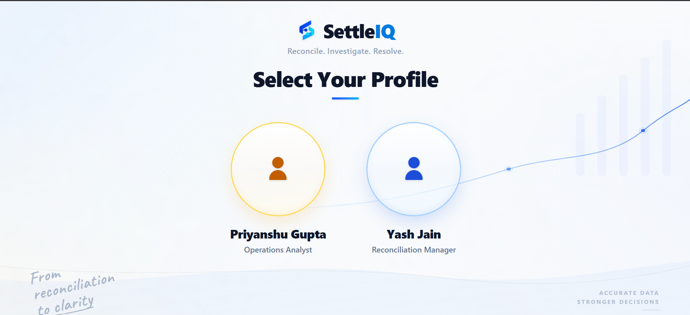

---

## Dashboard

The operations dashboard serves as the executive mission control, providing real-time visibility into overall reconciliation match rates, processed batch transaction volumes, and financial settlement parity.

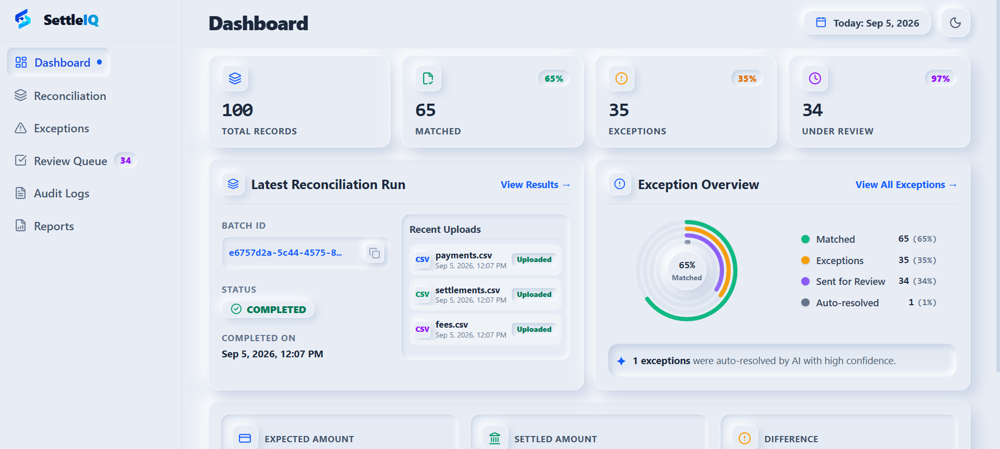

The financial summary section tracks gross expected order volumes against processor payout deposits, surfacing unsettled discrepancy amounts and clear status indicators across statement batches.

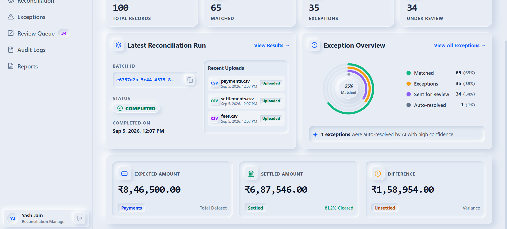

---

## Reconciliation

The Reconciliation Hub displays execution metrics for batch matching runs, categorizing detected exceptions across deterministic discrepancy taxonomies and showing volume distributions.

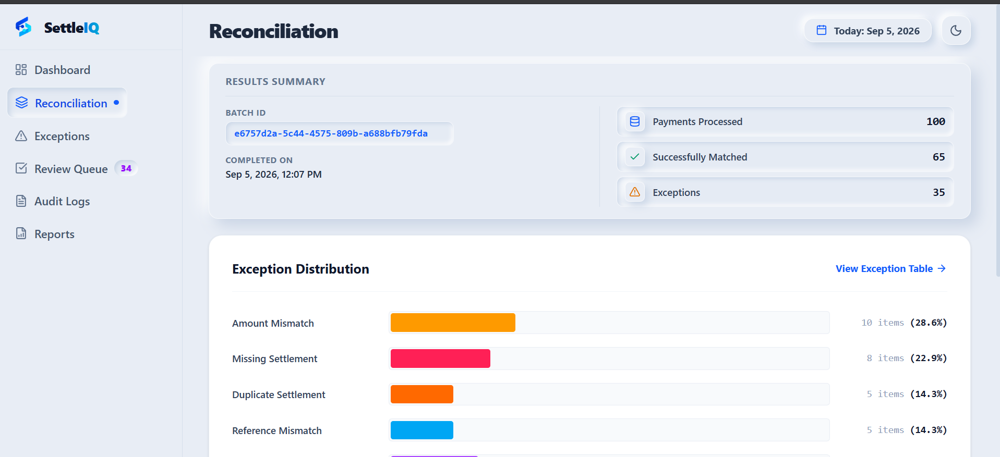

Financial parity cards display the initial settlement variance alongside the prominent **Run AI Investigation** action, which launches automated root-cause analysis and deterministic guardrail evaluation across all flagged exceptions.

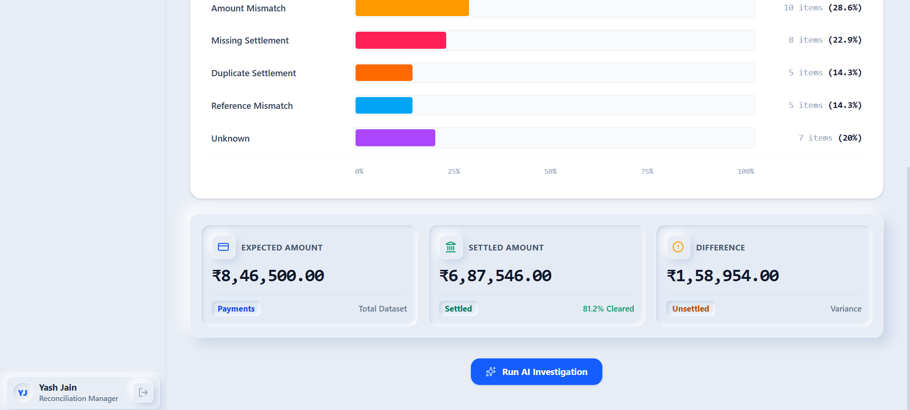

---

## Exception Investigation

The Exceptions view provides a tabular inventory of all detected reconciliation discrepancies with severity tags, calculated variance amounts, and deep-dive inspection triggers.

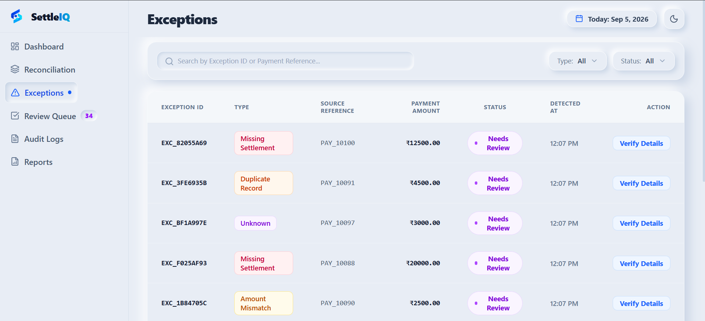

### Exception Detail: Financial Records
The Financial Records tab of the deep-dive modal presents correlated source data—linking the internal payment record with processor settlements and fee statements side-by-side to highlight exact discrepancies.

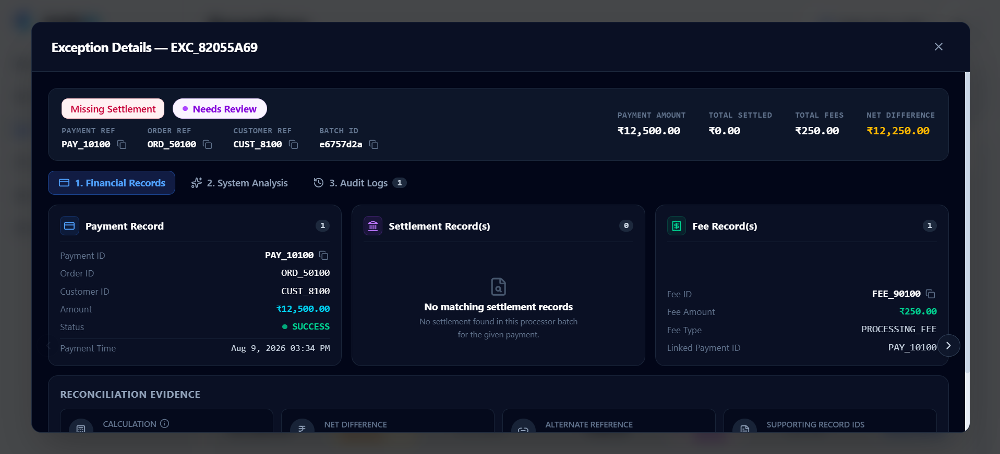

### Exception Detail: System Analysis & Guardrails
The System Analysis tab reveals the AI investigation findings alongside the 5-point deterministic guardrail verification check. Guardrails enforce policy constraints—in this case, safely preventing auto-resolution for a missing settlement and routing the exception for explicit human verification.

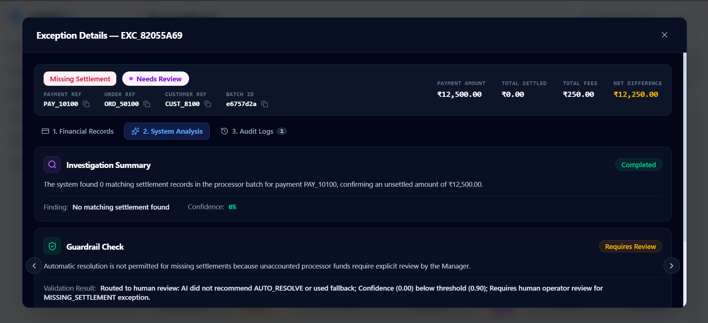

### Exception Detail: Audit Log
The Audit Logs tab provides an immutable record of all lifecycle events associated with the specific exception, capturing automated rule triggers, routing decisions, and timestamps.

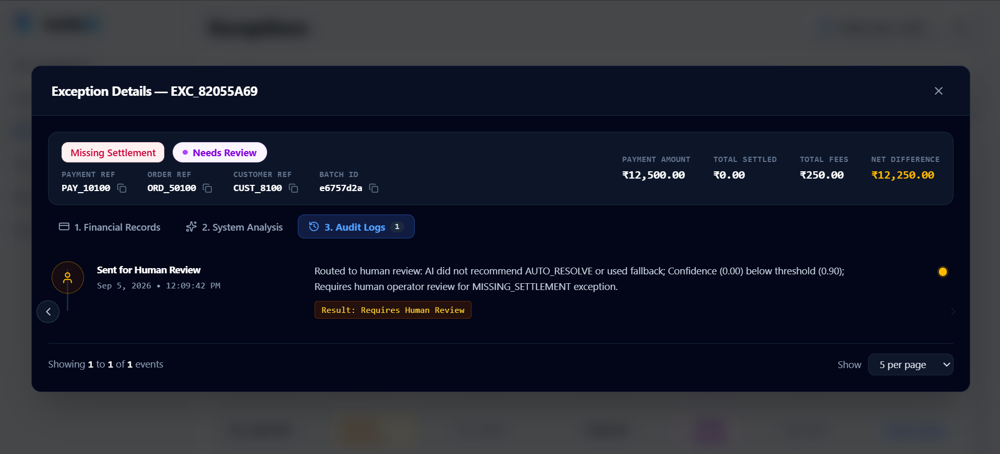

---

## Human Review Queue

The Review Queue provides a dedicated workspace for Reconciliation Managers to inspect exceptions requiring human verification. Managers review compiled transaction evidence, input compliance notes, and submit binding decisions (`Approve & Resolve`, `Reject / Dispute`, or `Keep Pending`).

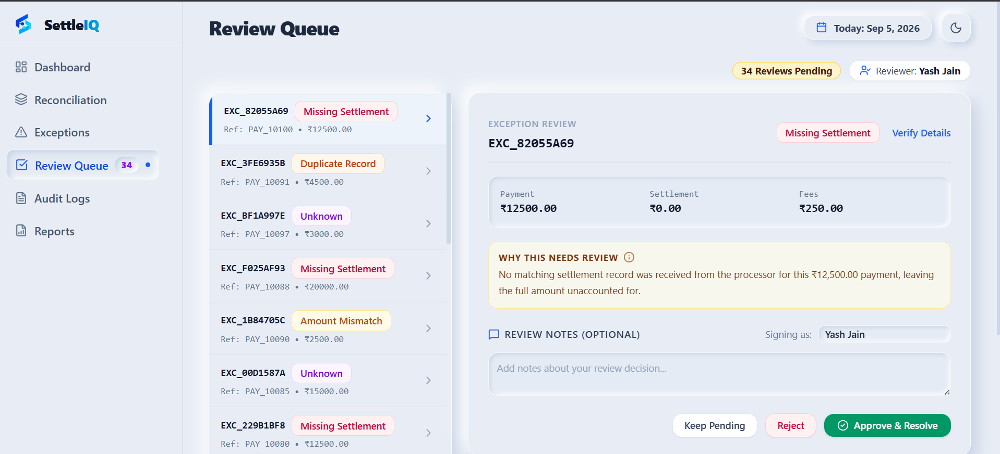

---

## Audit Logs

The central Audit Logs view ensures institutional compliance and complete traceability by capturing every system event—from multi-file ingestion and reconciliation runs to AI investigations, guardrail verdicts, and manager sign-offs—with actor IDs, UTC timestamps, and inspectable JSON metadata.

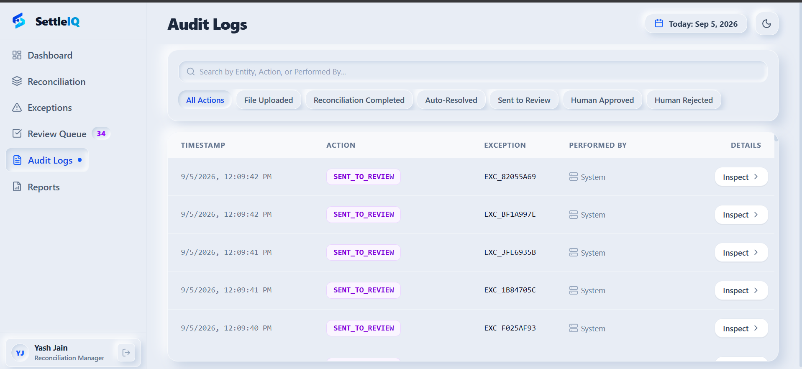

---

## Reports

The Reports view enables operations teams to generate executive reconciliation summaries, aggregating key financial metrics, match rates, and exception resolution statistics into formal audit reports with instant PDF export.

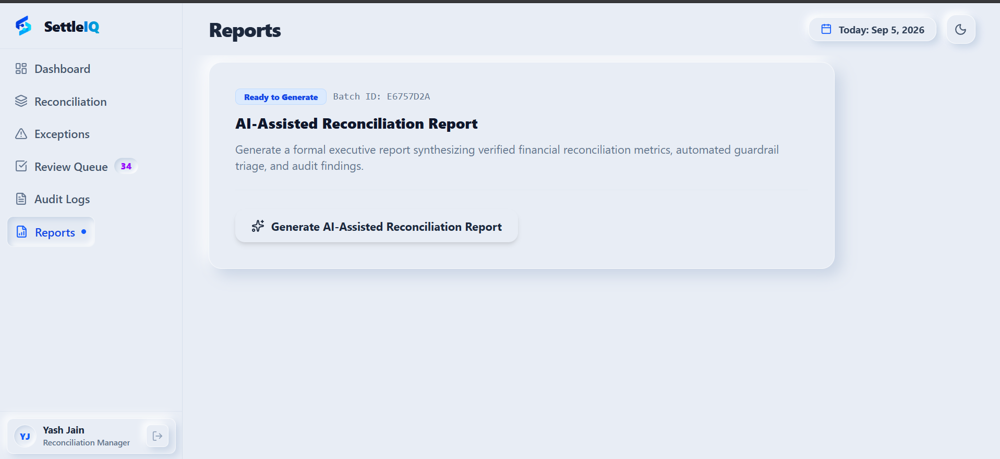

---

## Role-Based Workflow

SettleIQ tailors navigation and capabilities to the user's operational responsibilities:

### Operations Analyst
The Operations Analyst workspace is optimized for data ingestion and verification, providing multi-source CSV drag-and-drop upload cards (`payments.csv`, `settlements.csv`, `fees.csv`) with instant schema validation and batch ingestion history.

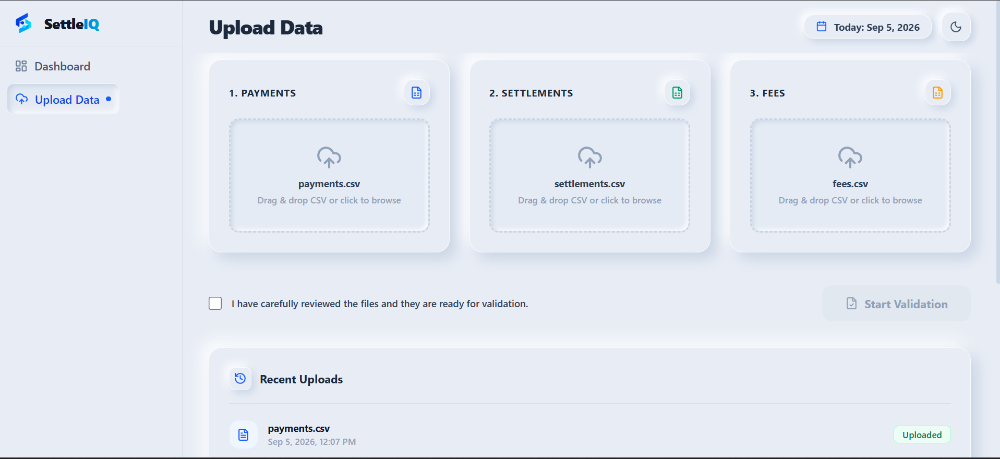

### Reconciliation Manager
The Reconciliation Manager workspace provides unrestricted oversight across the entire reconciliation lifecycle, including exception triage, AI investigation, Review Queue sign-off, compliance audit inspection, and report export.

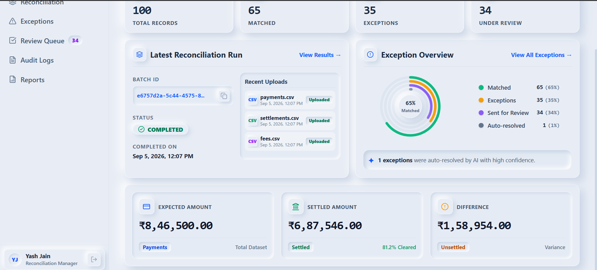

> 📄 For a complete step-by-step walkthrough of the user journey and maker-checker lifecycle, see the **[User Flows Specification](05_USER_FLOWS.pdf)**.
